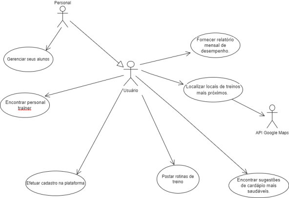

# Especificações do Projeto

## Personas
Para definir as personas, tivemos 7 perguntas que deu a base para a criação delas. As perguntas foram: Nome, Idade, Profissão, Tem costume de fazer atividades físicas? Quais?, Se a resposta anterior for sim, você tem costume de fazer em grupo ou individual? E isso te motiva mais?, Costuma alimentar de maneira saudável?, Se a resposta anterior foi não, gostaria de obter uma alimentação saudável? 

**Persona 1**

Angélica Dias, tem 24 anos, trabalha com posso ajudar em um banco. Ela costuma praticar atividades fisicas, pratica crossfit e corrida Costuma fazer suas atividades fisicas de maneira individual, mas não tem uma alimentação saudável e nem gostaria de ter.
 
**Persona 2**

Sampa, tem 40 anos, trabalha como famacêutico. Ele não possui o habito de praticar exercicios fisico e  por isso não pratica em grupo ou de forma individual. O mesmo não possui uma alimentação saudavel, mas gostaria de obter uma.

**Persona 3**

Astolfo Galifianacks, tem 35 anos, trabalha como personal trainer. Ele possi o habito de fazer atividades fisicas, pratica musculação. Faz seus exercicios em grupo, pois acredita que da uma motivação maior. O mesmo possui uma alimentação saudável.

**Persona 4**

Raimunda, tem 65 anos, já e aposentada. Pois o habito de fazer atividade fisica, ela faz caminhada. Gosta de fazer sua caminhada como seu marido, pois um motiva o outro. Ela possui uma alimentação saudável, mas gostaria de obter mais conhecimento sobre alimentação.

## Histórias de Usuários

Com base na análise das personas forma identificadas as seguintes histórias de usuários:

|EU COMO... `PERSONA`| QUERO/PRECISO ... `FUNCIONALIDADE` |PARA ... `MOTIVO/VALOR`                 |
|--------------------|------------------------------------|----------------------------------------|
|Usuário do sistema  | Registrar minhas tarefas           | Não esquecer de fazê-las               |
|Administrador       | Alterar permissões                 | Permitir que possam administrar contas |

Apresente aqui as histórias de usuário que são relevantes para o projeto de sua solução. As Histórias de Usuário consistem em uma ferramenta poderosa para a compreensão e elicitação dos requisitos funcionais e não funcionais da sua aplicação. Se possível, agrupe as histórias de usuário por contexto, para facilitar consultas recorrentes à essa parte do documento.

> **Links Úteis**:
> - [Histórias de usuários com exemplos e template](https://www.atlassian.com/br/agile/project-management/user-stories)
> - [Como escrever boas histórias de usuário (User Stories)](https://medium.com/vertice/como-escrever-boas-users-stories-hist%C3%B3rias-de-usu%C3%A1rios-b29c75043fac)
> - [User Stories: requisitos que humanos entendem](https://www.luiztools.com.br/post/user-stories-descricao-de-requisitos-que-humanos-entendem/)
> - [Histórias de Usuários: mais exemplos](https://www.reqview.com/doc/user-stories-example.html)
> - [9 Common User Story Mistakes](https://airfocus.com/blog/user-story-mistakes/)

## Requisitos

As tabelas que se seguem apresentam os requisitos funcionais e não funcionais que detalham o escopo do projeto.

### Requisitos Funcionais

|ID    | Descrição do Requisito  | Prioridade |
|------|-----------------------------------------|----|
|RF-001| O sistema deve permitir a postagem de rotinas de treinos.                                       | ALTA | 
|RF-002| O sistema deve ter uma opção onde o usuário possa verificar locais para treinos mais próximos.  | ALTA |
|RF-003| O sistema deve possibilitar ao usuário encontrar o seu personal trainer.                        | MÉDIA |
|RF-004| O sistema deve possibilitar ao usuário encontrar sugestões de receitas mais saudáveis.          | MÉDIA |
|RF-005| O sistema deve possibilitar ao usuário uma comunicação interativa através de chat.              | MÉDIA |
|RF-006| O sistema deve possibilitar ao usuário criação de agenda de treinos.                            | BAIXA |
|RF-007| O sistema deve ter possibilidades de metas relacionadas aos seus treinos.                       | ALTA |
|RF-008| O sistema deve possibilitar ao usuário o fornecimento de um relatório mensal.                   | MÉDIA |
|RF-009| O sistema deve possibilitar ao personal um gerenciamento de seus alunos.                        | MÉDIA |
|RF-010| O sistema deve possibilitar o usuário criar seu cadastro com e-mail e senha.                    | MÉDIA |
|RF-011| O sistema deve ter o sistema de Login.                                                          | MÉDIA |

### Requisitos não Funcionais

|ID     | Descrição do Requisito  |Prioridade |
|-------|-------------------------|----|
|RNF-001| O sistema deve ser responsivo.                                                                        | BAIXA | 
|RNF-002| Site deve ser compatível com os principais (Google Chrome, Mozilla Firefox, Safari e Microsoft Edge). |  ALTA |
|RNF-003| Site terá um layout minimalista.                                                                      |  ALTA | 
|RNF-004| O sistema deve utilizar banco de dados, MySQL.                                                        |  ALTA |  

## Restrições

O projeto está restrito pelos itens apresentados na tabela a seguir.

|ID| Restrições                                                          |
|--|---------------------------------------------------------------------|
|RE-01| Não pode contratar terceiros para desenvolvimento do projeto.    |
|RE-02| Projeto deve ser entregado até o final do semestre.              |
|RE-03| Apresentação e funcionamento terão foco em front-end e back end. |

## Diagrama de Casos de Uso

O UML (Unified Modeling Language) é uma linguagem de notação (um jeito de escrever, ilustrar, comunicar) para uso em projetos de sistemas. O objetivo do diagrama de caso de uso o UML é demonstrar as diferentes maneiras que o usuário pode interagir com um sistema. 

