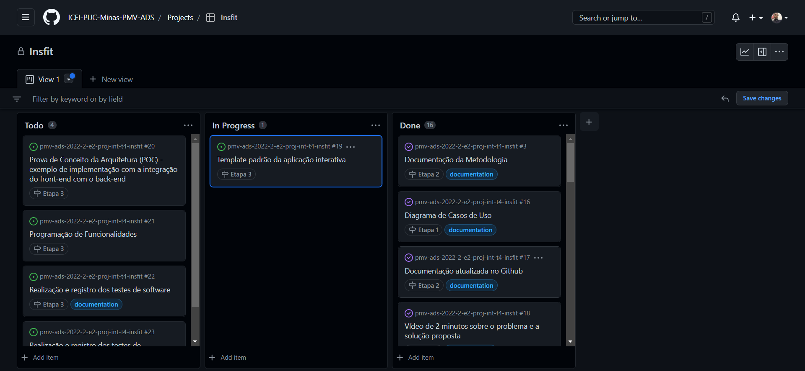

# Metodologia

Pré-requisitos: <a href="2-Especificação do Projeto.md"> Documentação de Especificação</a>

## Relação de Ambiente de Trabalho
Para que tenhamos uma boa produtividade no desenvolvimento do nosso software iremos usar as seguintes ferramentas:

|Ambiente                        | Plataforma            |Link de Acesso                                           |
|--------------------------------|-----------------------|-------------------------------------------------------------------------------------------------------------------------------------------------------------------------------------------------------|
|Documentos do Projeto           |One Drive              | https://sgapucminasbr-my.sharepoint.com/:w:/r/personal/1348060_sga_pucminas_br/_layouts/15/Doc.aspx?sourcedoc=%7B6FC544EE-5CD7-4163-A41A-7732616C78AB%7D&file=PROJETO%20INSFIT_ETAPA%201.docx&action=default&mobileredirect=true|
|Repositório de Código Fonte      |Git Hub                | https://github.com/ICEI-PUC-Minas-PMV-ADS/pmv-ads-2022-2-e2-proj-int-t4-insfit |
|Projeto de Interface e wireframes |Figma                  |               https://www.figma.com/file/G9jtERsiQJjU8Eex8T98xq/Easy-Peasy-Wireframe-Kit-(Community)?node-id=202%3A726                                                  |
|Gerenciamento de Projeto          |Git Action             |   https://github.com/orgs/ICEI-PUC-Minas-PMV-ADS/projects/149/views/1 |

## Controle de Versão

A ferramenta de controle de versão adotada no projeto foi o
[Git](https://git-scm.com/), sendo que o [Github](https://github.com)
foi utilizado para hospedagem do repositório.

O projeto segue a seguinte convenção para o nome de branches:

- `main`: versão estável já testada do software
- `dev`: versão de desenvolvimento do software

Quanto à gerência de issues, o projeto adota a seguinte convenção para
etiquetas:

- `documentation`: melhorias ou acréscimos à documentação
- `bug`: uma funcionalidade encontra-se com problemas
- `enhancement`: uma funcionalidade precisa ser melhorada
- `feature`: uma nova funcionalidade precisa ser introduzida

## Gerenciamento de Projeto

### Divisão de Papéis

Para gerenciamento do projeto utilizaremos a metodologia ágil scrum. 
Nossa equipe se encontra organizada da seguinte maneira:  

    Matheus Ferreira Pires - Desenvolvedor 
    Matheus Lemos Sampaio – Design e Desenvolvedor 
    Pedro Assis Silva de Almeida - Product Owner e Desenvolvedor 
    Vinícius Eduardo Silva Oliveira - Desenvolvedor 
    Vitor Hugo Silva Ribeiro- Scrum Master e Desenvolvedor  

### Processo
Para organização e distribuição de tarefas do projeto, utilizaremos o Git Action estruturado da seguinte forma:

Product Backlog: Nessa parte fica todas as tarefas que vão ser desenvolvidas no projeto. Caso apareça alguma nova e direcionada nessa parte. To Do (Sprint Backlog): E a sprint atual que estamos trabalhando. Progress: Quando a tarefas foi iniciada. Done: Quando a tarefa for finalizada.

 
### Ferramentas

As ferramentas empregadas no projeto são:

- Editor de código: Visual Studio 2022.
- Meio de Comunicação: Discord
- Desenho as telas e dos diagramas: Figma
- Gestão de código fonte: Git e GitHub
- Hospedagem: Microsoft Azure
- Banco de dados: SQL (Structured Query Language)

Escolhemos o visual studio 2022 pois ele tem uma boa integração com o C#. Para os desenvolvimento das telas e dos diagrmas, optamos por usar o figma devido a facilidade que a plataforma oferece para compartilhar o desenvolvimentos com os outros usuario e pelo fato de ser simples de usar. No meio de comunicação e na gestão do código fonto, o grupo optou por ambas as plataformas devido a familiaridade dos mesmo com a plataforma. Quanto as hospedagem, escolhemos o microsoft azure pelo fato der termos creditos e ele já possui um banco de dados SQL (Structured Query Language) na própria plataforma.
 