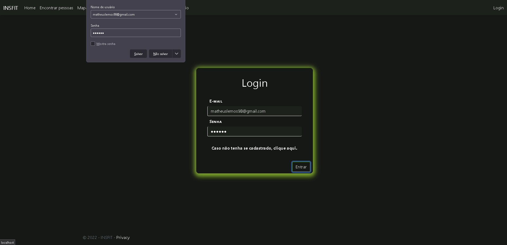

# Registro de Testes de Software

## LOGIN

## Caso de teste 01 - Realizar o cadastro do usuário

1- Caso de sucesso: Usuário cadastrado do sistema.

2- Caso de Insucesso: Mensagem de erro informando para preencher os campos.

## Caso de teste 02 - Validação do e-mail no cadastro

1- Caso de sucesso: Sistema permite prosseguir com a inserção dos dados.

2- Caso de Insucesso: Mensagem de erro informando que o e-mail inserido é inválido.

## Caso de teste 01 - Realizar o login

1- Caso de sucesso: Login permitirá acessar o sistema.

2- Caso de Insucesso: Mensagem de erro informando que o usuário não está cadastrado.

## Caso de teste 02 - Preenchimento dos campos ao efetuar login/cadastro

1- Caso de sucesso: Sistema permitirá realizar o login.

2- Caso de Insucesso: Mensagem de erro informando para o usuário preencher os campos.

## Caso de teste 03 - Validação do e-mail do login

1- Caso de sucesso: Sistema não apresentará mensagem de erro.

2- Caso de Insucesso: Mensagem de erro informando que o e-mail é inválido.

## PERFIL

## Cao de teste 01 - Criando um perfil para o usaurio

1- Caso de sucesso: Perfil Cadastrado 

2- Caso de insucesso: Perfil não cadastrado por falta de informação

## Caso de teste 02 - Mostrando dados do usuario logado

1- Caso de sucesso: Mostrando o dado correto do usuario

## ECONTRAR PESSOAS

1- Caso de Sucesso: Conseguir pesquisar pelo nome ou pelo tipo de usuario

## FEED 

## Caso de teste 01 - Criação de publicações no feed

1- Caso de sucesso: Preenchendo todos os campos publicação vai para o feed normalmente.

2- Caso de Insucesso: Mensagem de erro com o campo vazio.

## Caso de teste 02 - Possibilidade da visualização de postagens atuais.

1- Caso de sucesso: Postagens atuais aparecendo corretamente.

2- Caso de insucesso: Publicações com imagem ainda não carrega no feed.

## MAPA 

1- Caso de sucesso:

2- Caso de insucesso:

## DIETA 
## Caso de teste 01 - Criação de vizualização das dietas

1.1- Caso de sucesso:

1.2- Caso de sucesso:

2- Caso de insucesso:

## Relatório

## Caso de teste 01- O sistema calcula os dados corretamente.

1- Caso de sucesso:
.png)

1.1- Caso de sucesso:
.png)

2- Caso de insucesso:

